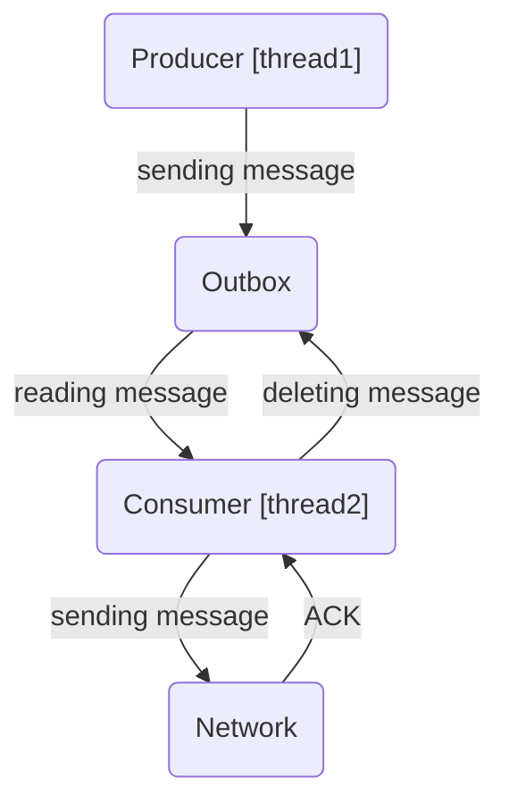
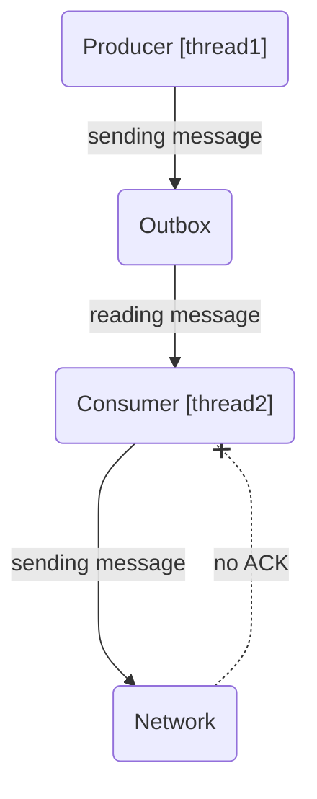

Simple SQLite-based design pattern Outbox. Used in application which produces a stream of messages and sends it to the collector service over unreliable network connection.

*Pic 1. Successful delivery*

*Pic 1. Unsuccessful delivery*

